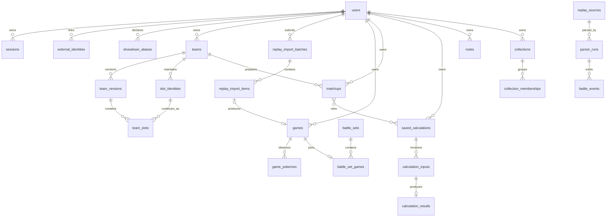

# P1 data models

## Purpose and scope

This document describes the complete logical data model at the end of P1. It includes the P0 foundation because P1 records cannot be understood safely without their parent records, provenance, ownership, and lifecycle rules.

The model is implementation-oriented but remains independent of a particular migration number. Physical migrations may split a logical table across releases, provided the constraints and invariants below remain true.

Markers used throughout:

- **P0** — required by the first usable product.
- **P1** — added or materially expanded during P1.
- **Derived** — computed from canonical records and not authoritative source data.
- **Conditional** — persisted only if profiling proves that a derived cache is required.

P2 tournament ingestion, AI preparation, advertising, sessions/testing blocks, custom dashboards, and user-defined metrics are intentionally excluded.

## Global conventions

| Concern           | Rule                                                                                                                                          |
| ----------------- | --------------------------------------------------------------------------------------------------------------------------------------------- |
| Identifiers       | Application-generated UUIDv7 values stored as PostgreSQL `uuid`.                                                                              |
| Time              | UTC `timestamptz`; user-local conversion occurs at the interface boundary.                                                                    |
| Ownership         | Every private aggregate root has `user_id`; child authorization joins to that root. Caller-supplied tenant IDs are never trusted.             |
| Revisions         | Concurrently editable roots use an integer `revision`, incremented atomically with `WHERE revision = expected_revision`.                      |
| Deletion          | Referenced or recoverable user records use `deleted_at`; account purge physically deletes or anonymizes according to retention policy.        |
| Enums             | Checked `text`, not PostgreSQL enum types, so values can be introduced with backward-compatible migrations.                                   |
| Unknowns          | Unknown observations are `NULL` or carry an explicit quality state. They are never silently converted to `false`, zero, or an inferred fact.  |
| Ingested text     | Normalized/queryable values retain their raw source at the ingestion boundary.                                                                |
| Derived data      | Carries source/parser/catalog/mechanics/metric versions and `computed_at` where relevant.                                                     |
| Secrets           | Only hashes or provider secret references are stored. Raw session, reset, capture, and provider credentials are never persisted.              |
| Flexible payloads | JSONB is permitted for versioned mechanics, safe provider metadata, and extensible event payloads; commonly filtered facts use typed columns. |
| Money/percentages | Percentages are derived from integer numerator/denominator pairs and are never the sole stored value.                                         |

Unless stated otherwise, mutable tables have `created_at`, `updated_at`, and integer `revision`; soft-deletable roots also have `deleted_at`.

## Relationship overview



## Identity and account lifecycle

### `users` — P0, expanded P1

Application account and tenant root.

| Column                     | Type          | Null | Notes                                                                          |
| -------------------------- | ------------- | ---- | ------------------------------------------------------------------------------ |
| `id`                       | `uuid`        | no   | Primary key.                                                                   |
| `email_normalized`         | `text`        | no   | Case-folded login address; unique among non-purged accounts.                   |
| `password_hash`            | `text`        | yes  | Argon2id PHC string; nullable only when an external-only account is supported. |
| `display_name`             | `text`        | yes  | User-facing name, not an authorization identity.                               |
| `account_state`            | `text`        | no   | `active \| deletion_pending \| disabled`; default `active`.                    |
| `deletion_requested_at`    | `timestamptz` | yes  | P1 lifecycle marker.                                                           |
| `deleted_at`               | `timestamptz` | yes  | Access is denied whenever set.                                                 |
| `created_at`, `updated_at` | `timestamptz` | no   | Audit timestamps.                                                              |
| `revision`                 | `integer`     | no   | Optimistic concurrency for profile changes.                                    |

Constraints and indexes:

- Unique index on `email_normalized` for live/non-purged accounts.
- Check that an active account has at least one usable authentication method.
- Email changes and account-state changes create `audit_events` without copying the address into audit metadata.

### `sessions` — P0

Revocable database-backed browser sessions.

| Column                                   | Type          | Null | Notes                                                                   |
| ---------------------------------------- | ------------- | ---- | ----------------------------------------------------------------------- |
| `id`                                     | `uuid`        | no   | Primary key.                                                            |
| `user_id`                                | `uuid`        | no   | FK to `users`.                                                          |
| `token_hash`                             | `bytea`       | no   | Unique SHA-256 hash of the opaque cookie value.                         |
| `created_at`, `last_seen_at`             | `timestamptz` | no   | Activity metadata.                                                      |
| `idle_expires_at`, `absolute_expires_at` | `timestamptz` | no   | Both are enforced server-side.                                          |
| `revoked_at`                             | `timestamptz` | yes  | Set by logout, password reset, account disable, or explicit revocation. |
| `user_agent_summary`                     | `text`        | yes  | Coarse display-safe session label; never the full raw header.           |

Indexes: unique `token_hash`; `(user_id, revoked_at, absolute_expires_at)` for session lists and revocation.

### `password_reset_tokens` — P0

| Column                      | Type          | Null | Notes                                                   |
| --------------------------- | ------------- | ---- | ------------------------------------------------------- |
| `id`, `user_id`             | `uuid`        | no   | PK and FK to `users`.                                   |
| `token_hash`                | `bytea`       | no   | Unique hash; raw token appears only in the reset email. |
| `expires_at`, `created_at`  | `timestamptz` | no   | Validity window.                                        |
| `used_at`, `invalidated_at` | `timestamptz` | yes  | Single-use and supersession state.                      |

Issuing a new token invalidates outstanding tokens for the account in the same transaction.

### `external_identities` — P1

Links Google or a later approved identity provider to the application account.

| Column                      | Type          | Null   | Notes                                                                    |
| --------------------------- | ------------- | ------ | ------------------------------------------------------------------------ |
| `id`, `user_id`             | `uuid`        | no     | PK and FK to `users`.                                                    |
| `provider`                  | `text`        | no     | Initially `google`.                                                      |
| `provider_subject`          | `text`        | no     | Stable provider subject, not email.                                      |
| `email_at_link_time`        | `text`        | yes    | Optional normalized audit/display value; never used as the durable link. |
| `linked_at`, `last_used_at` | `timestamptz` | no/yes | Lifecycle timestamps.                                                    |
| `unlinked_at`               | `timestamptz` | yes    | Retained audit state.                                                    |

Unique `(provider, provider_subject)` and unique live `(user_id, provider)`. Unlinking is rejected if it would leave the account without a usable authentication method.

### `showdown_aliases` — P0

| Column                     | Type          | Null | Notes                               |
| -------------------------- | ------------- | ---- | ----------------------------------- |
| `id`, `user_id`            | `uuid`        | no   | PK and owner.                       |
| `username_display`         | `text`        | no   | User-entered display spelling.      |
| `username_normalized`      | `text`        | no   | Showdown-normalized comparison key. |
| `is_default`               | `boolean`     | no   | At most one default per user.       |
| `created_at`, `updated_at` | `timestamptz` | no   | Timestamps.                         |

Unique `(user_id, username_normalized)`. An alias is never globally unique or treated as verified identity.

### `account_export_requests` — P1

Tracks generation and expiry of machine-readable account exports.

| Column                                                       | Type          | Null  | Notes                                                           |
| ------------------------------------------------------------ | ------------- | ----- | --------------------------------------------------------------- |
| `id`, `user_id`                                              | `uuid`        | no    | PK and owner.                                                   |
| `status`                                                     | `text`        | no    | `queued \| running \| ready \| failed \| cancelled \| expired`. |
| `format_version`                                             | `text`        | no    | Version of the documented export schema.                        |
| `job_id`                                                     | `uuid`        | yes   | FK to `jobs`; set when queued.                                  |
| `artifact_key`                                               | `text`        | yes   | Opaque storage locator, never a public URL.                     |
| `artifact_checksum`                                          | `text`        | yes   | Integrity checksum.                                             |
| `safe_error_code`                                            | `text`        | yes   | No private export contents.                                     |
| `requested_at`, `completed_at`, `expires_at`, `cancelled_at` | `timestamptz` | mixed | Lifecycle timestamps.                                           |

Only one active export per user and format version is allowed. Download authorization always rechecks the owning account.

### `account_deletion_requests` — P1

| Column                          | Type          | Null | Notes                                                                  |
| ------------------------------- | ------------- | ---- | ---------------------------------------------------------------------- |
| `id`, `user_id`                 | `uuid`        | no   | PK and owner.                                                          |
| `status`                        | `text`        | no   | `pending \| scheduled \| purging \| completed \| cancelled \| failed`. |
| `requested_at`, `scheduled_for` | `timestamptz` | no   | Approved purge delay is policy-driven.                                 |
| `cancelled_at`, `completed_at`  | `timestamptz` | yes  | Lifecycle timestamps.                                                  |
| `job_id`                        | `uuid`        | yes  | FK to the idempotent `account.purge` job.                              |
| `safe_error_code`               | `text`        | yes  | Operational failure classification.                                    |

Creating the request disables access immediately. Cancellation is possible only before purge begins. Completion leaves non-identifying audit proof, not a retained user row containing personal data.

## Catalog, mechanics, and rules

### `catalog_versions` — P0

| Column                                        | Type          | Null   | Notes                           |
| --------------------------------------------- | ------------- | ------ | ------------------------------- |
| `id`                                          | `uuid`        | no     | PK.                             |
| `version_label`                               | `text`        | no     | Unique semantic/source version. |
| `source_name`, `source_version`, `license_id` | `text`        | no     | Provenance.                     |
| `checksum`                                    | `text`        | no     | Unique content checksum.        |
| `effective_from`, `effective_to`              | `timestamptz` | no/yes | Applicability window.           |
| `created_at`                                  | `timestamptz` | no     | Import timestamp.               |

Catalog versions are append-only once referenced.

### Canonical entity tables — P0

`species`, `forms`, `moves`, `items`, `abilities`, and `natures` each contain:

| Column                  | Type          | Null | Notes                          |
| ----------------------- | ------------- | ---- | ------------------------------ |
| `id`                    | `uuid`        | no   | Stable internal PK.            |
| `canonical_slug`        | `text`        | no   | Globally unique stable slug.   |
| `introduced_generation` | `smallint`    | yes  | Provenance/filtering metadata. |
| `retired_at`            | `timestamptz` | yes  | Never reuse IDs.               |

`forms` additionally has non-null `species_id`. A form is unique by `(species_id, canonical_slug)`.

### Versioned catalog data — P0

Each canonical entity has a companion table named `<entity>_catalog_data`, keyed by `(catalog_version_id, <entity>_id)`. Common columns are `display_name`, `localized_names jsonb`, `mechanics jsonb`, `is_legal`, and provenance fields. Frequently filtered mechanics become typed columns when required by parser or calculator queries.

### `rulesets` — P0, administrable P1

| Column                                     | Type              | Null | Notes                             |
| ------------------------------------------ | ----------------- | ---- | --------------------------------- |
| `id`                                       | `uuid`            | no   | PK.                               |
| `canonical_slug`, `display_name`           | `text`            | no   | Stable key and label.             |
| `game`, `generation`                       | `text`/`smallint` | no   | Rules context.                    |
| `team_size`, `bring_size`, `default_level` | `smallint`        | no   | Validated positive bounds.        |
| `level_policy`, `mechanics_config`         | `jsonb`           | no   | Versioned semantic configuration. |
| `catalog_version_id`                       | `uuid`            | no   | FK to `catalog_versions`.         |
| `state`                                    | `text`            | no   | `draft \| active \| retired`.     |
| `config_revision`                          | `integer`         | no   | Incremented for admin edits.      |
| `created_at`, `updated_at`                 | `timestamptz`     | no   | Timestamps.                       |

Referenced semantic configurations are immutable: a breaking mechanics change creates a successor ruleset/config revision rather than rewriting historical meaning.

### `replay_formats` — P1

Admin-managed mapping from provider format IDs to supported rulesets.

| Column                           | Type          | Null | Notes                            |
| -------------------------------- | ------------- | ---- | -------------------------------- |
| `id`                             | `uuid`        | no   | PK.                              |
| `provider`, `provider_format_id` | `text`        | no   | Unique provider mapping.         |
| `ruleset_id`                     | `uuid`        | no   | FK to `rulesets`.                |
| `parser_profile`                 | `text`        | no   | Versioned parser behavior key.   |
| `state`                          | `text`        | no   | `testing \| active \| disabled`. |
| `valid_from`, `valid_to`         | `timestamptz` | yes  | Optional date window.            |
| `created_at`, `updated_at`       | `timestamptz` | no   | Timestamps.                      |

### `external_id_mappings` — P0

Maps provider identifiers to canonical catalog entities.

Columns: `id`, `provider`, `entity_kind`, `provider_identifier`, `canonical_entity_id`, `catalog_version_id`, `confidence`, `provenance`, `created_at`. Unique `(provider, entity_kind, provider_identifier, catalog_version_id)`.

## Teams and organization

### `teams` — P0

Persistent team identity.

Columns: `id`, `user_id`, `title`, `description`, `status`, `created_at`, `updated_at`, `archived_at`, `deleted_at`, `revision`. Status is `active | testing | archived`. Index `(user_id, status, updated_at desc)`.

### `team_versions` — P0, expanded P1

Immutable competitive snapshot, except while explicitly unsealed and unreferenced.

| Column                             | Type          | Null   | Notes                                                               |
| ---------------------------------- | ------------- | ------ | ------------------------------------------------------------------- |
| `id`, `team_id`                    | `uuid`        | no     | PK and FK.                                                          |
| `version_number`                   | `integer`     | no     | Monotonically increasing within team.                               |
| `ruleset_id`, `catalog_version_id` | `uuid`        | no     | Semantic versions.                                                  |
| `change_summary`                   | `text`        | yes    | User-facing description.                                            |
| `source_kind`                      | `text`        | no     | `showdown_text \| pokepaste \| manual`.                             |
| `source_text`                      | `text`        | yes    | Original import text when applicable.                               |
| `completeness_state`               | `text`        | no     | P1: `complete \| exploratory \| invalid`. P0 saves only `complete`. |
| `created_at`, `sealed_at`          | `timestamptz` | no/yes | Lifecycle.                                                          |
| `revision`                         | `integer`     | no     | Changes only while draft is mutable.                                |

Unique `(team_id, version_number)`. A historical game, calculation, or matchup dependency seals the version atomically.

### `slot_identities` — P0

Logical continuity for the same team member across versions.

Columns: `id`, `team_id`, `label`, `created_at`, `retired_at`. Species replacement creates a new identity unless the user explicitly confirms continuity. Unique ownership is enforced through the parent team.

### `team_slots` — P0, expanded P1

| Column                                      | Type       | Null | Notes                                              |
| ------------------------------------------- | ---------- | ---- | -------------------------------------------------- |
| `id`, `team_version_id`, `slot_identity_id` | `uuid`     | no   | PK and parents.                                    |
| `slot_number`                               | `smallint` | no   | 1–6; unique per version.                           |
| `species_id`, `form_id`                     | `uuid`     | yes  | Species may be null only for P1 exploratory slots. |
| `nickname`, `gender`                        | `text`     | yes  | Validated against ruleset relevance.               |
| `level`                                     | `smallint` | yes  | Null only when incomplete and explicitly unknown.  |
| `item_id`, `ability_id`, `nature_id`        | `uuid`     | yes  | Canonical references.                              |
| `mechanics`                                 | `jsonb`    | no   | Ruleset-validated special mechanics; default `{}`. |
| `completeness_state`                        | `text`     | no   | `complete \| incomplete \| placeholder`.           |

The `slot_identity_id` must belong to the same team as the containing version.

### `team_slot_moves` and `team_slot_evs` — P0

- `team_slot_moves`: `team_slot_id`, `ordinal` (1–4), nullable `move_id` for P1 incomplete slots, and `is_known`; PK `(team_slot_id, ordinal)`.
- `team_slot_evs`: one row per slot with nullable `hp`, `attack`, `defense`, `special_attack`, `special_defense`, `speed`, plus `is_complete`. Known values are non-negative and ruleset totals are enforced by service validation.
- IVs remain out of scope through P1.

### `team_validation_issues` — P1

Retains actionable issues for persistent exploratory versions without contaminating analytics.

Columns: `id`, `team_version_id`, nullable `team_slot_id`, `field_path`, `code`, `severity`, `message_key`, `details jsonb`, `created_at`, `resolved_at`. Severity is `warning | error`. Analytics excludes versions whose `completeness_state` is not `complete` unless a metric explicitly supports them.

### `tags` and `tag_assignments` — P0

- `tags`: `id`, `user_id`, `label`, `label_normalized`, optional `color`, timestamps; unique `(user_id, label_normalized)`.
- `tag_assignments`: `tag_id`, `subject_type`, `subject_id`, `created_at`; unique `(tag_id, subject_type, subject_id)`.
- Supported subject types through P1: team, team version, game, battle set, matchup, opposing set/team, archetype, calculation, collection.
- Services validate subject ownership because a polymorphic FK cannot enforce it alone.

### `collections` and `collection_memberships` — P1

Folders, events, seasons, and preparation projects share one nested organization model.

| Table                    | Columns and rules                                                                                                                                                                                                                                                       |
| ------------------------ | ----------------------------------------------------------------------------------------------------------------------------------------------------------------------------------------------------------------------------------------------------------------------- |
| `collections`            | `id`, `user_id`, nullable `parent_id`, `kind`, `name`, `description`, optional `starts_at`/`ends_at`, `position`, timestamps, `deleted_at`, `revision`. Kind: `folder \| event \| season \| preparation_project`. Parent must have the same owner; cycles are rejected. |
| `collection_memberships` | `id`, `collection_id`, `subject_type`, `subject_id`, `position`, `created_at`; unique `(collection_id, subject_type, subject_id)`. Initially groups teams and may also group games, battle sets, and matchups. Ownership is service-validated.                          |

## Replay ingestion, parsed battles, and manual records

### `replay_import_batches` — P0, expanded P1

Columns: `id`, `user_id`, `source_kind`, requested `team_id`, `team_version_id`, `showdown_alias_id`, `user_side`, `status`, total/success/error/needs-input counts, `idempotency_key`, timestamps. P1 source kinds add `capture` and `structured_file` to `url_batch`.

Unique `(user_id, idempotency_key)`. Status is derived from items and may be cached transactionally.

### `replay_import_items` — P0, expanded P1

Columns: `id`, `batch_id`, `original_locator`, `canonical_locator`, `provider`, `provider_replay_id`, `structured_source_id`, `status`, `safe_error_code`, `safe_error_detail`, `existing_game_id`, timestamps. Exactly one provider locator or structured source reference is present. Unique trustworthy `(user_id via batch, provider, provider_replay_id)` is enforced using a reservation key/table or denormalized owner column.

Status: `queued | fetching | parsing | needs_input | succeeded | duplicate | failed | cancelled`.

### `structured_import_sources` — P1

Retains user-submitted CSV/PASRS-compatible source sufficiently to diagnose and reprocess it.

Columns: `id`, `user_id`, `format`, `schema_version`, `original_filename`, `content_type`, `raw_content bytea`, `content_checksum`, `received_at`, `retention_state`. Unique `(user_id, content_checksum, format)` is a duplicate signal, not automatic game merging.

### `replay_sources` — P0

Columns: `id`, `provider`, `provider_replay_id`, `canonical_url`, `raw_content bytea`, `content_checksum`, `content_type`, `content_encoding`, `retrieved_at`, `source_metadata jsonb`, `retention_state`. Raw content and private URLs are never logged. A source is retained while any game depends on it, subject to provider/legal deletion.

### `parser_runs` — P0

Columns: `id`, `replay_source_id`, `parser_name`, `parser_version`, `catalog_version_id`, `status`, `started_at`, `completed_at`, `safe_error_code`, `output_checksum`, `warnings jsonb`. Every run is append-only; a failed reparse never replaces the selected accepted run.

### `games` — P0, expanded P1

| Column                                                      | Type             | Null  | Notes                                           |
| ----------------------------------------------------------- | ---------------- | ----- | ----------------------------------------------- |
| `id`, `user_id`                                             | `uuid`           | no    | PK and tenant root.                             |
| `record_kind`                                               | `text`           | no    | `replay \| structured_import \| manual`.        |
| `replay_source_id`, `structured_source_id`, `parser_run_id` | `uuid`           | yes   | Provenance appropriate to record kind.          |
| `ruleset_id`, `team_id`, `team_version_id`                  | `uuid`           | mixed | Team version remains nullable when ambiguous.   |
| `occurred_at`                                               | `timestamptz`    | yes   | Unknown remains null.                           |
| `player_1_name`, `player_2_name`                            | `text`           | yes   | Source display values.                          |
| `user_side`, `winner_side`                                  | `text`           | yes   | `p1 \| p2`; null when unknown.                  |
| `result`                                                    | `text`           | no    | `win \| loss \| tie \| unknown`.                |
| `match_format`                                              | `text`           | no    | `bo1 \| bo3 \| unknown`.                        |
| `ladder_name`, `ladder_rating`                              | `text`/`integer` | yes   | P1 filter fields.                               |
| `sheet_state`                                               | `text`           | no    | `open \| closed \| unknown`; may be corrected.  |
| `sheet_state_confidence`                                    | `text`           | no    | `explicit \| inferred \| corrected \| unknown`. |
| `import_status`                                             | `text`           | no    | Effective record state.                         |
| `created_at`, `updated_at`, `deleted_at`                    | `timestamptz`    | mixed | Lifecycle.                                      |

Record-kind constraint:

- `replay` requires replay source and accepted parser run.
- `structured_import` requires structured source but may omit parser run.
- `manual` requires neither source and is always visibly user-entered.

Indexes include `(user_id, occurred_at desc)`, `(user_id, team_id, team_version_id)`, result/context filters, opponent lookup support, and partial indexes for unresolved attribution.

### `game_sides` and `game_pokemon` — P0, expanded P1

- `game_sides`: `id`, `game_id`, `side`, `player_name`, `showdown_alias_id`, `preview_known`, `selection_complete`, quality fields; unique `(game_id, side)`.
- `game_pokemon`: `id`, `game_side_id`, `combatant_key`, nullable canonical `species_id`/`form_id`, nullable `previewed`/`selected`/`led`, linked `team_slot_id`, revealed item/ability/status fields, observation quality and provenance; unique `(game_side_id, combatant_key)`.
- P1 reveal fields do not overwrite team-sheet or team-version truth; they are battle observations.

### `battle_events` — P0, expanded P1

Columns: `id`, `parser_run_id`, `sequence`, nullable `turn`, `event_kind`, actor/target combatant keys, nullable canonical move/form/item/ability IDs, `payload jsonb`, `observation_state`, `source_line_reference`, `created_at`. Unique `(parser_run_id, sequence)`.

P0 kinds: preview, bring/reveal, lead, move, switch, mega, faint, result.

P1 adds damage, status, weather, terrain, ability, item, targeting, speed-order, and illusion/identity-evidence events. `observation_state` is `observed | inferred | ambiguous | user_corrected`; ambiguous mechanics never generate certain canonical facts.

### `game_corrections` — P0

Columns: `id`, `game_id`, `field_path`, `value_type`, `corrected_value jsonb`, `reason`, `actor_user_id`, `created_at`, `superseded_at`, `superseded_by_id`. Corrections are append-only overlays and are reapplied after compatible reparses.

### `battle_sets` and `battle_set_games` — P0

- `battle_sets`: `id`, `user_id`, nullable `provider_grouping_key`, `best_of_size`, `result`, `group_confidence`, timestamps, `revision`, `deleted_at`. Confidence: `exact | strong | manual`.
- `battle_set_games`: `battle_set_id`, `game_id`, `game_number`; PK membership and unique `game_id` ensure a game belongs to at most one set.
- Set result is derived from member games unless an audited correction exists.

### `capture_tokens` — P1

Narrowly scoped credentials for a browser extension or Showdown-side capture workflow.

Columns: `id`, `user_id`, `token_hash`, `label`, `scope`, `created_at`, `last_used_at`, `expires_at`, `revoked_at`. Scope is initially `replay:capture`; unique token hash. These tokens cannot access general account or private-data APIs.

## Notes, knowledge, and search

### `notes` — P0

Columns: `id`, `user_id`, `subject_type`, `subject_id`, `markdown_source`, `sanitized_render_cache`, timestamps, `deleted_at`, `revision`. Supported P1 subjects include team, team version, slot identity, game, battle set, matchup, opposing set/team, archetype, and calculation. Ownership is service-validated.

### `opposing_sets` — P0

Columns: `id`, `user_id`, `name`, `ruleset_id`, `catalog_version_id`, species/form, level, item, ability, nature, `mechanics jsonb`, `completeness_state`, `uncertainty jsonb`, `provenance_kind`, optional source game, timestamps, `deleted_at`, `revision`.

Child tables `opposing_set_moves` and `opposing_set_evs` mirror the team-slot move/EV shapes while allowing explicitly unknown values.

### `opposing_teams` and `opposing_team_members` — P0

- `opposing_teams`: `id`, `user_id`, `name`, `ruleset_id`, `source_kind`, optional `source_game_id`, description, timestamps, `deleted_at`, `revision`.
- `opposing_team_members`: `opposing_team_id`, `opposing_set_id`, `position`, `membership_state`; unique position and set membership per team.

### `archetypes` and `archetype_members` — P0, expanded P1

- `archetypes`: `id`, `user_id`, `name`, `description`, `ruleset_id`, `review_state`, timestamps, `deleted_at`, `revision`.
- `archetype_members`: `id`, `archetype_id`, `criterion_kind`, nullable species/form/opposing-set reference, `role`, `required`, `position`, `criteria jsonb`.
- Review state is `untested | testing | stable | needs_revision`.
- An archetype matchup can be cloned to an opponent-team matchup; the clone records provenance but becomes independently editable.

### Search model — P1, derived

Global search does not introduce a second source-of-truth table initially. PostgreSQL full-text/search indexes are maintained on owned canonical tables:

- teams and team versions;
- canonical species/form display names through catalog joins;
- opponent sets/teams and archetypes;
- notes;
- matchups;
- games, replay IDs, and opponent display names.

Search results use the derived read model:

```text
SearchResult {
  kind
  id
  title
  excerpt?
  matchedFields[]
  updatedAt
  route
}
```

Every query is scoped by `user_id` before ranking. If measured query cost later requires a search projection, it must be rebuildable from canonical tables and carry a fact watermark; an external search service is not part of P1.

## Matchups

### `matchups` — P0, expanded P1

Columns: `id`, `user_id`, `team_id`, `last_validated_team_version_id`, exactly one target (`opposing_team_id`, `archetype_id`, or `selected_opponent_definition jsonb`), `source_matchup_id`, title, general plan, win conditions, threats/failure modes, turn-one options, `review_state`, timestamps, `deleted_at`, `revision`.

Review state: `untested | testing | stable | needs_revision`. `source_matchup_id` is P1 clone provenance only; later changes do not propagate implicitly.

### Structured matchup choices — P0

- `matchup_choices`: `id`, `matchup_id`, `kind`, `rank`, `label`, `notes`; kind is `preferred_lead | preferred_back | alternative_composition`.
- `matchup_choice_slots`: `matchup_choice_id`, `ordinal`, `slot_identity_id`; unique ordinal and member.
- Preferred leads contain exactly two slots; full compositions respect the ruleset bring size.

### Evidence and dependencies — P0, expanded P1

- `matchup_games`: `matchup_id`, `game_id`, optional evidence note, `created_at`; unique pair.
- `matchup_calculations`: `matchup_id`, `calculation_id`, optional label, position, `created_at`; unique pair.
- `matchup_dependencies`: `id`, `matchup_id`, `slot_identity_id`, referenced traits mask/snapshot, `last_validated_team_version_id`, state, findings JSONB, timestamps.
- P1 empirical results are derived from `matchup_games` and effective game results, returning wins/losses/ties, sample size, and explicit perspective. They are not independently editable aggregates.

## Damage calculations

### `saved_calculations` — P0

Columns: `id`, `user_id`, `name`, `notes`, nullable primary `matchup_id`, `ruleset_id`, `dependency_mode`, `status`, timestamps, `deleted_at`, `revision`. Mode: `follow_latest | pinned_version | static_copy`. Status: `current | recompute_pending | outdated | invalid`.

### `calculation_inputs` — P0

Immutable semantic revisions.

Columns: `id`, `calculation_id`, `revision_number`, attacker/defender source descriptors, resolved normalized attacker/defender snapshots JSONB, move ID, battle-state fields/JSONB, mechanics/catalog versions, semantic input checksum, `created_at`. Unique `(calculation_id, revision_number)` and indexed checksum/version tuple.

### `calculation_results` — P0

Columns: `id`, `calculation_input_id`, engine name/version, integer minimum/maximum, integer roll distribution JSONB, HP and percentage bounds, KO summary/probabilities JSONB, assumptions/warnings JSONB, status, `computed_at`. One accepted result per input revision; unsupported scenarios retain an explicit status rather than an approximation.

### `calculation_dependencies` — P0, expanded P1

Columns: `id`, `calculation_id`, `side`, referenced team/slot/version or opposing-set ID, watched-field mask, last resolved version, state, invalidation reason, timestamps. Exactly one supported reference target is present. P1 invalidation distinguishes removed slot, species/form change, missing move/item/ability, spread/level change, incompatible ruleset, and unsupported mechanic.

### `calculation_embeds` — P1

Canonical links that embed one saved calculation without copying it.

Columns: `id`, `calculation_id`, `subject_type`, `subject_id`, `label`, `position`, `created_at`. Subject types are `note | matchup`; unique `(calculation_id, subject_type, subject_id)`. Subject and calculation must share an owner.

### P1 calculator request/read models — derived

Matrices, breakpoint searches, and comparisons are computations over canonical semantic inputs. They are not saved automatically.

```text
CalculationMatrixRequest {
  axis: user_team | opposing_team
  sourceReferences[]
  targetReferences[]
  movePolicy
  fieldState
  rulesetId
}

BreakpointRequest {
  objective: survive | knockout | outspeed
  mutableSide
  baseSemanticInput
  permittedEvBudget
}

CalculationComparisonRequest {
  leftInput
  rightInput
  labels
}
```

Responses include normalized inputs, engine/catalog/mechanics versions, assumptions, warnings, and individual result cells. A user may explicitly save any cell as a normal `saved_calculations` record.

## Analytics models

Analytics reads effective canonical game facts after corrections. P1 trends, comparisons, uncertainty, extended filters, and drill-down do not create editable source tables.

### Common filter model — derived

```text
AnalyticsFilter {
  teamId
  teamVersionIds[]?
  startInclusive?
  endExclusive?
  rulesetIds[]?
  results[]?
  opposingSpeciesIds[]?
  matchFormats[]?
  showdownAliasIds[]?       // P1
  ladderNames[]?            // P1
  minimumRating?            // P1
  maximumRating?            // P1
  collectionOrEventIds[]?   // P1
  tagIds[]?                 // P1
  sheetStates[]?            // P1
  opponentQuery?            // P1
}
```

### Metric result and drill-down — derived

```text
MetricValue {
  metricKey
  metricVersion
  unit: game | set
  numerator
  denominator
  rate?
  sampleSize
  unknownCount
  normalizedFilters
  uncertainty?
}

MetricContributionPage {
  metricKey
  normalizedFilters
  contributingGameIds[]
  contributingSetIds[]
  excludedUnknownCount
  cursor?
}
```

Trend buckets use inclusive-start/exclusive-end UTC boundaries. Version comparisons return the same metric keys for both exact version cohorts plus numeric deltas; they do not rewrite historical attribution. Small-sample warnings or intervals include their method/version.

### Analytics summaries — conditional

Begin with indexed SQL over canonical tables. Only if `EXPLAIN ANALYZE` against the 10,000-game fixture misses the target may a narrowly scoped summary table be introduced. Any summary must store metric version, normalized-filter key, source fact watermark, numerator, denominator, unknown count, and computed time, and must be fully rebuildable.

## Jobs, administration, and operational records

### `jobs` — P0, expanded P1

| Column                                     | Type          | Null   | Notes                                                                        |
| ------------------------------------------ | ------------- | ------ | ---------------------------------------------------------------------------- |
| `id`                                       | `uuid`        | no     | PK.                                                                          |
| `kind`                                     | `text`        | no     | Includes replay import/reparse, calculation recompute, account export/purge. |
| `user_id`                                  | `uuid`        | yes    | Owning user when applicable.                                                 |
| `subject_type`, `subject_id`               | `text`/`uuid` | no     | Authoritative work locator; private payload is not copied here.              |
| `idempotency_key`                          | `text`        | no     | Unique within job kind/owner.                                                |
| `status`                                   | `text`        | no     | `available \| running \| retry_wait \| succeeded \| failed \| cancelled`.    |
| `priority`                                 | `smallint`    | no     | Bounded queue priority.                                                      |
| `available_at`, `lease_expires_at`         | `timestamptz` | no/yes | Claim/retry timing.                                                          |
| `leased_by`                                | `text`        | yes    | Worker instance identifier.                                                  |
| `attempt_count`, `max_attempts`            | `smallint`    | no     | Bounded retry state.                                                         |
| `safe_error_code`, `safe_error_detail`     | `text`        | yes    | Redacted diagnostics.                                                        |
| `correlation_id`                           | `uuid`        | no     | Request/job trace link.                                                      |
| `created_at`, `updated_at`, `completed_at` | `timestamptz` | mixed  | Lifecycle.                                                                   |

Claim index: `(status, available_at, priority desc)` with partial coverage for claimable states. Workers use `FOR UPDATE SKIP LOCKED` and bounded leases. Exhausted work remains `failed`; this is the P1 dead-letter state.

### `job_attempts` — P1

Append-only operational history: `id`, `job_id`, `attempt_number`, `worker_id`, `started_at`, `finished_at`, `outcome`, `safe_error_code`, `duration_ms`, `correlation_id`. No private inputs or raw provider responses.

### `job_retry_requests` — P1

Audits explicit retry of terminal work: `id`, `job_id`, `requested_by_user_id`, `requested_at`, `reason_code`, `resulting_job_id`. Admin authorization permits diagnostics/retry, not access to private subject contents.

### `audit_events` — P0

Columns: `id`, nullable actor user/operator/worker identifiers, `action`, `resource_kind`, nullable `resource_id`, `occurred_at`, `correlation_id`, coarse `change_metadata jsonb`. Raw teams, replays, notes, calculations, credentials, emails, and tokens are prohibited.

### `feature_flags` — P1

Columns: `id`, `key`, `value_type`, `environment`, `enabled`, `rollout_config jsonb`, `description`, `revision`, `created_by`, timestamps. Unique `(key, environment)`. Defaults are safe/off; all changes emit audit events. Rollout config may target a percentage or explicit test accounts but must not encode private competitive data.

### `provider_settings` — P1

Admin-managed non-secret integration configuration.

Columns: `id`, `provider`, `environment`, `state`, `base_url`, timeout/response-size/rate-limit settings, `credential_secret_reference`, `config jsonb`, `revision`, timestamps. Unique `(provider, environment)`. Secrets remain in the managed secret facility; the database stores only the reference. Disabling a provider never blocks reads of already stored core data.

## Referential and lifecycle rules

1. No cross-user link is valid, including tags, collection membership, notes, matchup evidence, calculation embeds/dependencies, manual associations, and retry actions.
2. A sealed team version and its slots, moves, and EVs are immutable while referenced. Changes create a successor version.
3. A confirmed `game.team_version_id` never follows later team edits. Reattribution is an explicit audited correction.
4. A game belongs to at most one battle set. Game and set analytics remain separate.
5. Duplicate replay provider IDs for one user resolve to the existing import/game and never add a second analytic fact.
6. Parser runs, battle facts per run, calculation input/results, job attempts, corrections, and audit events are append-only evidence.
7. Reparsing may select a new accepted parser run but preserves raw source, prior runs, notes, corrections, and manual evidence links.
8. Incomplete/exploratory teams are visibly marked and excluded from ordinary analytics denominators until the required facts are complete.
9. Manual games and structured imports are permanently distinguishable from provider replays.
10. Unknown and partial observations do not satisfy true or false metric predicates; exclusions and unknown counts remain visible.
11. Calculation recomputation appends revisions. Invalid dependencies preserve the last valid result and expose a reason.
12. Account deletion disables access immediately, cancels active sessions/tokens, and uses an idempotent purge job; backup expiry follows the documented retention schedule.

## Required indexes and database checks

At minimum, migrations provide:

- ownership/time indexes on each user root;
- unique normalized user email and per-user Showdown alias indexes;
- session/reset/capture token-hash indexes;
- team version number and slot-position uniqueness;
- provider replay identity, content checksum, and import-state indexes;
- game owner/date, team/version, result/context, opponent species, ladder/rating, and attribution-state indexes;
- parser event sequence and accepted-run lookup indexes;
- battle-set single-membership and order constraints;
- tag/collection/search indexes scoped by owner;
- matchup target exclusivity and dependency-state indexes;
- calculation checksum/revision/dependency-state indexes;
- claimable-job, terminal-job, idempotency, and lease-expiry indexes;
- full-text or trigram indexes only for the fields exercised by P1 global search.

Polymorphic subject links cannot be protected by ordinary foreign keys alone. Their services must lock/resolve the target, verify same-user ownership, and create the link in one transaction. Integration tests treat that rule as a database boundary even when enforcement includes service code.

## Requirement coverage

| P1 requirement group | Principal model changes                                                                                       |
| -------------------- | ------------------------------------------------------------------------------------------------------------- |
| FR-1.6–1.7           | `external_identities`, account deletion state/requests, session/token revocation.                             |
| FR-2.10–2.12         | Collections/memberships, complete export representation, exploratory team completeness and validation issues. |
| FR-3.9–3.11          | Capture tokens, structured sources/import kinds, permanently marked manual games.                             |
| FR-4.6–4.8           | Extended battle events, observation quality, revealed combatant facts, sheet-state confidence.                |
| FR-6.8–6.12          | Extended typed filters and reproducible derived trend/comparison/uncertainty/drill-down models.               |
| FR-7.7–7.9, 7.11     | Archetype membership, clone provenance, review state, empirical evidence derived from linked games.           |
| FR-8.12, 8.14–8.17   | Derived matrix/breakpoint/comparison requests, precise invalidation state, canonical calculation embeds.      |
| FR-11.3              | Owner-scoped PostgreSQL search indexes and a unified derived result contract.                                 |
| FR-12.1              | Versioned account export requests/artifacts.                                                                  |
| FR-14.3–14.5         | Replay format/provider configuration, feature flags, job attempts, terminal failures, explicit retry audit.   |

## Explicit non-models through P1

- Team export text is rendered deterministically from a team version; it is not a separate canonical table.
- Hosted Poképaste creation is not assumed. A provider response may be recorded as export provenance only if that integration is later approved.
- Analytics rates, trends, comparisons, matchup records, and uncertainty are derived from facts; they are not user-editable aggregates.
- Calculator matrices and breakpoint searches are request/result shapes unless the user explicitly saves an individual calculation.
- Global search begins with PostgreSQL indexes; no external search index is required.
- Raw application secrets, session/reset/capture tokens, and provider credentials are never data-model fields.

## Open decisions before corresponding P1 migrations

The model preserves seams for these decisions without blocking P0 implementation:

1. Exact live-data purge delay, export artifact retention, and backup expiry policy.
2. Approved Google/OIDC provider configuration and account-linking recovery policy.
3. Supported CSV/PASRS schema versions and retention period for uploaded source files.
4. Whether browser capture uses long-lived scoped tokens or a short-lived device authorization flow; either choice stores only token hashes.
5. Exact uncertainty method for small analytics samples.
6. Whether any approved Poképaste integration can create hosted pastes; text export remains the baseline.
